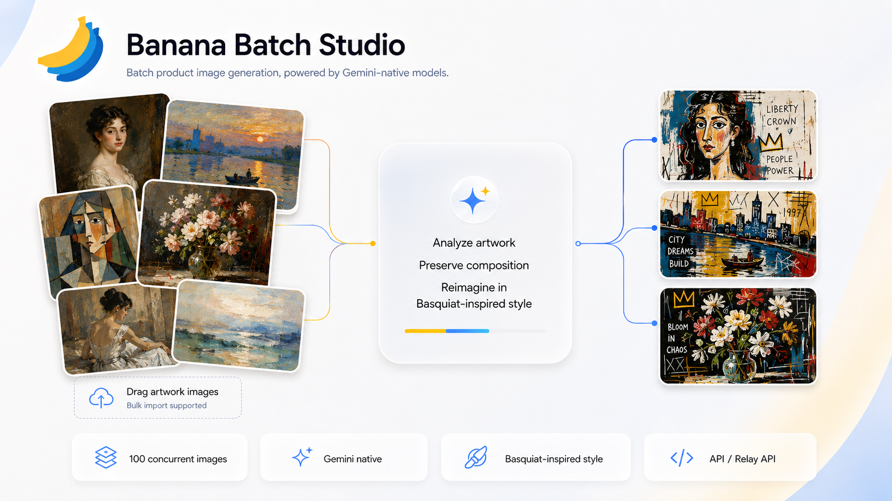

# Banana Batch Studio

> 一個提示詞，批次處理多張圖片。本機執行的 BANANA/Gemini 圖片批次生成桌面工具。

**語言**：[中文](../../README.md) | 繁體中文 | [English](README.en.md) | [日本語](README.ja.md) | [한국어](README.ko.md)

目前版本：`v2.0.2`


Banana Batch Studio 是一個本機執行的批次圖片生成工具，專門處理一個很具體的工作流：**多張圖片使用同一個提示詞和同一組參考圖，批次並行輸出結果**。

它適合電商、設計、影視、短影音和 AI 圖像工作流使用者。你可以拖入一批主圖，加入參考圖或墊圖，填寫同一個提示詞，選擇模型和參數，然後並行生成結果。圖片會從你的電腦直接送到你設定的 Google Gemini API 或相容中轉 API，不會經過第三方伺服器。


> 目前桌面介面。



> 產品概念圖。

## 下載

請在 GitHub Releases 頁面下載最新桌面版本：

[下載 Banana Batch Studio v2.0.2](https://github.com/bleeeet/banana-batch-studio/releases/tag/v2.0.2)

| 平台 | 安裝包 | 說明 |
|---|---|---|
| macOS Apple Silicon | `Banana Batch Studio (Apple Silicon).app` | 適用於 M1/M2/M3/M4 Mac |
| macOS Intel | `Banana Batch Studio (Intel).app` | 適用於 Intel Mac |
| Windows x64 | `BananaBatchStudio-Windows-x64/` | 執行 `start.bat` |

## 功能

| 功能 | 說明 |
|---|---|
| 多圖拖放 / 點選 | 支援一次加入多張圖片，也可以選擇圖片或資料夾 |
| 圖片堆疊預覽 | 上傳後顯示真實縮圖，並以堆疊卡片形式預覽 |
| 參考圖 / 墊圖 | 支援為整批主圖加入同一組參考圖 |
| 即時並行 | 預設最大並行 10，可調整，最高 100 |
| Batch 模式 | 支援 Gemini Batch Job，適合更大批量和成本敏感任務 |
| API 通道 | 支援 Google 官方 API 和 Gemini 相容中轉 API |
| 預設管理 | 儲存模型、提示詞、比例、尺寸、Temperature 和處理模式，支援 JSON 匯入 / 匯出 |
| 資料夾匯出 | 將全部成功結果圖匯出到下載資料夾中的普通資料夾 |
| 多語言介面 | 支援簡體中文、繁體中文、English、日本語、한국어 |
| 本機執行 | 本機服務監聽 `127.0.0.1:4178` |

## 快速開始

1. 從 GitHub Releases 下載 App。
2. 開啟 `Banana Batch Studio (Apple Silicon).app` 或 `Banana Batch Studio (Intel).app`。
3. 選擇 API 通道：Google 官方 API 或 Gemini 相容中轉 API。
4. 儲存你的 API key。
5. 拖入圖片，或點選 `選圖片 / 選資料夾`。
6. 可選：使用 `添加參考圖` 加入墊圖或參考圖。
7. 輸入同一個批次提示詞。
8. 選擇模型、比例、尺寸、Temperature、請求間隔和並行數。
9. 點選 `開始生成`。
10. 下載單張圖片、重試失敗項、編輯已儲存任務的提示詞、重建任務，或匯出全部結果資料夾。

如果 macOS 提示無法驗證開發者，請在 Finder 右鍵 App，選擇 `打開`，再確認一次。

## API 通道

| API 通道 | 適合場景 |
|---|---|
| Google 官方 API | 直接使用 Google AI Studio / Gemini API key |
| Gemini 相容中轉 API | 使用相容 Gemini API 格式的中轉服務，自訂 API 位址和模型列表 |

應用不會內建或強制代理。網路連線交由你的系統網路、VPN、代理或分流規則處理。

應用不自帶 API key。你需要提供自己的 Google Gemini API key 或中轉 API key。

## 資料和隱私

Banana Batch Studio 在本機執行。任務記錄和生成檔案會保存在你的電腦上。

**Mac App 資料路徑：**

```text
~/Library/Application Support/BananaBatchStudio/
  uploads/       上傳圖片副本
  outputs/       生成結果
  batch/         Batch 模式請求檔案
  zips/          舊版 ZIP 匯出快取
  jobs.json      任務記錄
  api-keys.json  API key，本機明文 JSON 保存
```

**Windows 資料路徑：**

```text
%APPDATA%\BananaBatchStudio\
```

重要說明：公開發布包不會包含你的個人 API key，也不會包含你的個人保存預設。API key 和保存預設都在使用者自己的本機設定目錄裡，不會被打進公開桌面包。

## 開發與打包

```bash
npm install
npm run dev
npm run package:mac
npm run package:windows
```

GitHub 倉庫只提交原始碼，`.app` 和 Windows 包請放到 GitHub Releases。

## 使用技術

- [Google Gemini / Google AI API](https://ai.google.dev/)：圖片生成模型能力。
- [Bun](https://bun.sh/)：打包後的本機執行環境。
- [React](https://react.dev/)：桌面 Web 介面。
- [Vite](https://vite.dev/)：前端開發和生產構建。

## License

ISC
